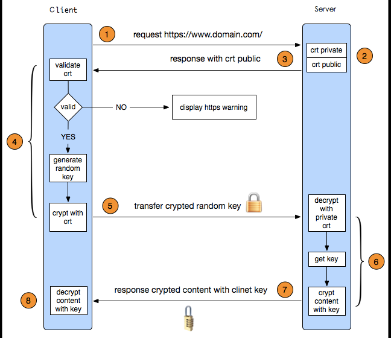

- [密码学基础](#密码学基础)
  - [对称加密](#对称加密)
  - [非对称加密](#非对称加密)
- [HTTPS通信过程](#https通信过程)
  - [HTTPS简单过程](#https简单过程)
  - [SSL/TLS](#ssltls)
  - [中间人攻击](#中间人攻击)
  - [证书的合法性](#证书的合法性)
  - [HTTPS详细过程](#https详细过程)
- [HTTP与HTTPS，HTTPS与HTTP的区别](#http与httpshttps与http的区别)
- [对网站进行HTTPS改造](#对网站进行https改造)
- [使用SPDY加快网站速度](#使用spdy加快网站速度)
- [SPDY与HTTP2.0](#spdy与http20)

http默认采用80作为通讯端口，对于传输采用不加密的方式，https默认采用443，对于传输的数据进行加密传输。

## 密码学基础

明文： 明文指的是未被加密过的原始数据。

密文：明文被某种加密算法加密之后，会变成密文，从而确保原始数据的安全。密文也可以被解密，得到原始的明文。

密钥：密钥是一种参数，它是在明文转换为密文或将密文转换为明文的算法中输入的参数。密钥分为对称密钥与非对称密钥，分别应用在对称加密和非对称加密上。

### 对称加密
对称加密，私钥加密，即信息的发送方和接收方使用同一个密钥去加密和解密数据。对称加密的特点是算法公开、加密和解密速度快，适合于对大数据量进行加密，常见的对称加密算法有DES、3DES、TDEA、Blowfish、RC5和IDEA。
```
其加密过程如下：明文 + 加密算法 + 私钥 => 密文
解密过程如下：密文 + 解密算法 + 私钥 => 明文
```
私钥表示个人私有的密钥，不能被泄露。

由于对称加密的算法是公开的，所以一旦私钥被泄露，那么密文就很容易被破解，所以对称加密的缺点是密钥安全管理困难。

### 非对称加密
非对称加密也叫做公钥加密。非对称加密与对称加密相比，其安全性更好。非对称加密使用一对密钥，即公钥和私钥，且二者成对出现。私钥被自己保存，不能对外泄露。公钥指的是公共的密钥，任何人都可以获得该密钥。用公钥或私钥中的任何一个进行加密，用另一个进行解密。

 - **被公钥加密过的密文只能被私钥解密**，过程如下：
```
明文 + 加密算法 + 公钥 => 密文， 密文 + 解密算法 + 私钥 => 明文
```

 - **被私钥加密过的密文只能被公钥解密**，过程如下：
```
明文 + 加密算法 + 私钥 => 密文， 密文 + 解密算法 + 公钥 => 明文
```

非对称加密的缺点是加密和解密花费时间长、速度慢，只适合对少量数据进行加密。
在非对称加密中使用的主要算法有：RSA、Elgamal、Rabin、D-H、ECC（椭圆曲线加密算法）等。

## HTTPS通信过程
### HTTPS简单过程
1. 客户端发https请求，要求建立ssl连接
2. 服务端发送网站证书（包含公钥）
3. 客户端检查证书，产生随机客户端密钥，并用公钥加密后传服务端
4. 服务端用私钥解密，得到客户端密钥
5. 之后的会话使用客户端密钥加密传输

### SSL/TLS
**HTTPS协议 = HTTP协议 + SSL/TLS协议**，在HTTPS数据传输的过程中，需要用SSL/TLS对数据进行加密和解密，需要用HTTP对加密后的数据进行传输，由此可以看出HTTPS是由HTTP和SSL/TLS一起合作完成的。

**SSL**的全称是Secure Sockets Layer，即安全套接层协议，是为网络通信提供安全及数据完整性的一种安全协议。SSL协议在1994年被Netscape发明，后来各个浏览器均支持SSL，其最新的版本是3.0。

**TLS**的全称是Transport Layer Security，即安全传输层协议，最新版本的TLS（Transport Layer Security，传输层安全协议）是IETF制定的一种新的协议，它建立在SSL 3.0协议规范之上，是SSL 3.0的后续版本。两者所支持的加密算法不同，所以TLS与SSL3.0不能互操作。虽然TLS与SSL3.0在加密算法上不同，但是在我们理解HTTPS的过程中，我们可以把SSL和TLS看做是同一个协议。

HTTPS为了兼顾安全与效率，**同时使用了对称加密和非对称加密**。数据是被对称加密传输的，对称加密过程需要客户端的一个密钥，为了确保能把该密钥安全传输到服务器端，采用非对称加密对该密钥进行加密传输<br>
总的来说，**对数据进行对称加密，对称加密所要使用的密钥通过非对称加密传输**。



HTTPS在传输的过程中会涉及到三个密钥：
 - 服务器端的公钥和私钥，用来进行非对称加密
 - 客户端生成的随机密钥，用来进行对称加密
### 中间人攻击
中间人可能拦截公钥的发送，伪造自己的公钥发给客户端。客户端返回时，中间人再次拦截，用正确加密发给服务端。此后，每次通信中间人都能解密。
### 证书的合法性
无证书时，存在中间人攻击问题
- 证书的制作：服务端公钥key1发给机构，机构加密①生成证书签名，证书签名加密②后给服务端
- 证书校验：浏览器和操作系统维护权威机构的名称和公钥，解密①验证证书真伪，解密②得到服务端公钥key1
- 证书签名由服务器端网址信息等生成，加密，无法篡改

### HTTPS详细过程
一个HTTPS请求实际上包含了两次HTTP传输，可以细分为8步。

1. 客户端向服务器发起HTTPS请求，连接到服务器的443端口
2. 服务器端有一个密钥对，即公钥和私钥，是用来进行非对称加密使用的，服务器端保存着私钥，不能将其泄露，公钥可以发送给任何人。
3. 服务器将自己的公钥发送给客户端。
4. 客户端收到服务器端的公钥之后，会对公钥进行检查，验证其合法性，如果发现发现公钥有问题，那么HTTPS传输就无法继续。严格的说，这里应该是验证服务器发送的数字证书的合法性。<br>
如果公钥合格，那么客户端会生成一个随机值，这个随机值就是用于进行对称加密的密钥，我们将该密钥称之为client key，即客户端密钥。然后用服务器的公钥对客户端密钥进行非对称加密，这样客户端密钥就变成密文了，至此，HTTPS中的第一次HTTP请求结束。
5. 客户端会发起HTTPS中的第二个HTTP请求，将加密之后的客户端密钥发送给服务器。
6. 服务器接收到客户端发来的密文之后，会用自己的私钥对其进行非对称解密，解密之后的明文就是客户端密钥，然后用客户端密钥对数据进行对称加密，这样数据就变成了密文。
7. 然后服务器将加密后的密文发送给客户端。
8. 客户端收到服务器发送来的密文，用客户端密钥对其进行对称解密，得到服务器发送的数据。这样HTTPS中的第二个HTTP请求结束，整个HTTPS传输完成。

##必要性
普遍认为客户端是不安全的，一旦私钥泄露，就会被他人截取密文，所以要以上流程。临时生成的随机数作为客户端对称加密秘钥不容易泄露
原文链接：https://www.jianshu.com/p/14cd2c9d2cd2

## HTTP与HTTPS，HTTPS与HTTP的区别
1. HTTPS协议需要CA申请证书
2. HTTP运行在TCP上，明文传输；HTTPS运行在SSL/TLS上，加密传输
3. 端口不同，80与443
4. HTTPS可以有效防止运营商劫持，解决了防劫持的一大问题

## 对网站进行HTTPS改造
1. 安装CA证书
2. 在证书提供的网站上配置自己的域名，配置服务器，代码改造
3. 降低用户访问速度，HTTPS在一定程度上减低速度，可用SPDY改进
4. 优化服务器，HTTPS中大量密钥的计算
   
## 使用SPDY加快网站速度
1. 降低延迟：采取多路复用
2. 请求优先级：避免关键请求被阻塞
3. header压缩
4. 强制使用HTTPS
5. 服务端推送
6. SPDY位于HTTP之下，TCP/SSL之上，可以见人HTTP1.X，同时使用自己的SSL功能
## SPDY与HTTP2.0
1. TTP2.0可以说是SPDY的升级版,或者说是基于SPDY设计的
2. HTTP2.0支持明文HTTP传输，SPDY强制HTTPS
3. HTTP2.0使用HPACK压缩请求头，SPDY使用DEFLATE