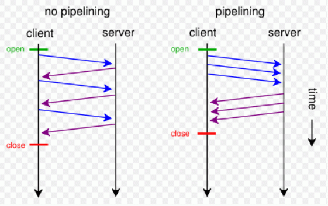

- [HTTP特性](#http特性)
  - [HTTP的优化](#http的优化)
  - [HTTP持久连接keep-alive（HTTP1.1支持）](#http持久连接keep-alivehttp11支持)
  - [HTTP管线化 （HTTP1.1支持）](#http管线化-http11支持)
  - [HTTP数据协商](#http数据协商)
    - [请求](#请求)
    - [响应](#响应)
    - [form 表单中enctype数据类型](#form-表单中enctype数据类型)
- [HTTP CSP 内容安全策略](#http-csp-内容安全策略)
- [HTTP1.X](#http1x)
  - [HTTP1.0和HTTP1.1的区别](#http10和http11的区别)
  - [HTTP1.x存在的问题](#http1x存在的问题)
- [HTTP2](#http2)
  - [二进制传输](#二进制传输)
  - [多路复用](#多路复用)
  - [Header 压缩](#header-压缩)
  - [服务端 Push](#服务端-push)
  - [HTTP首部](#http首部)
## HTTP特性

### HTTP的优化
1. 带宽：现已基本满足
2. 延迟：
   - 浏览器阻塞：同一域名超过最大连接数，后续阻塞
   - DNS查询：DNS将域名解析为IP费时，通过DNS缓存解决
   - 建立连接：TCP三次握手费时
  
### HTTP持久连接keep-alive（HTTP1.1支持）

HTTP协议采用“请求-应答”模式，并且HTTP是基于TCP进行连接的。普通模式（非keep-alive）时，每个请求或应答都需要建立一个连接，完成之后立即断开。

当使用`Conection: keep-alive`模式（又称持久连接、连接重用）时，keep-alive使客户端道服务器端连接持续有效，即不关闭底层的TCP连接，当出现对服务器的后继请求时，keep-alive功能避免重新建立连接。

`Conection: keep-alive` + `keep-alive:max=20`或`keep-alive:timeout = 20`设置超过请求次数则断开或超过时间断开（秒）

【好处】
- 较少的CPU和内存的使用（由于同时打开的连接的减少了）
- 允许请求和应答的HTTP管线化
- 降低拥塞控制 （TCP连接减少了）
- 减少了后续请求的延迟（无需再进行握手）
- 报告错误无需关闭TCP连

【如何知道结束】
- 1是判断传输数据是否达到了Content-Length指示的大小;
- 2动态生成的文件没有Content-Length，它是分块传输(chunked)，这时候就要根据chunked编码来判断，chunked编码的数据在最后有一个空chunked块，表明本次传输数据结束。

### HTTP管线化 （HTTP1.1支持）

管线化后，请求和响应不再是依次交替的了。他可以支持一次性发送多个请求，并一次性接收多个响应。

 - 只有get与head请求可以进行管线化，POST有限制
 - 初次创建连接时不应该启动管线机制，因为服务器不一定支持该协议【故应用不广泛】
 - 由于要求服务端返回响应数据的顺序必须跟客户端请求时的顺序一致，阻塞问题，故对性能的提升并不明显

### HTTP数据协商
在客户端向服务端发送请求的时候，客户端会申明可以接受的数据格式和数据相关的一些限制是什么样的；服务端在接受到这个请求时他会根据这个信息进行判断到底返回怎样的数据。

#### 请求
 - Accept 
   - 在请求中使用Accept可申明想要的数据格式
 - Accept-Encoding
   - 告诉服务端使用什么的方式来进行压缩
   - 例如：gzip、deflate、br
 - Accept-Language
   - 描述语言信息
 - User-Agent
   - 用来描述客户端浏览器相关信息
   - 可以用来区分PC端页面和移动端页面

#### 响应
 - Content-Type
   - 对应Accept，从请求中的Accept支持的数据格式中选一种来返回
 - Content-Encoding
   - 对应 Accept-Encoding，指服务端到底使用的是那种压缩方式
 - Content-Language
   - 对应Accept-Language

#### form 表单中enctype数据类型
 - `application/x-www-form-urlencoded`
   - key=value&key=value 格式
 - `multipart/form-data`
   - 用于提交文件
   - multipart表示请求是由多个部分组成（因为上传文件的时候文件不能以字符串形式提交，需要单独分出来）
   - boundary 用来分隔不同部分
 - `text/plain`

## [HTTP CSP 内容安全策略](https://developer.mozilla.org/zh-CN/docs/Web/Security/CSP)

CSP Content-Security-Policy
 - 限制资源获取
 - 报告资源获取越权

例子：
 - `Content-Security-Policy: default-src http: https:` 表示只允许通过http、https的方式加载资源
 - `'Content-Security-Policy': 'default-src' \'self\'; form-action\'self\' '` 表示只能加载本域下的资源，只能向本域发送表单请求

对称加密+非对称加密+ca证书+数字签名

## HTTP1.X
### HTTP1.0和HTTP1.1的区别
HTTP1.0是1996年，HTTP1.1是1999年 
1. `缓存处理`：新增了更多的缓存控制策略（更多种缓存头epress外增加Cache-Control）
2. 带宽优化&网络连接：新增range头域，允许请求资源的某个部分
3. 错误通知：新增24个状态错误码
4. Host头处理：增加Host头域，解决一台物理主机存在多个虚拟主机且共享ip的问题
5. `长连接`：支持长连接和请求的流水线处理，一个TCP连接上传送多个请求和响应

### HTTP1.x存在的问题
1. 传输数据时，每次重新建立连接
2. 明文传输，无法保障安全性
3. header携带内容过大，且重复
4. HTTP1.1支持keep-alive造成服务端压力（保持不必要的连接）
## HTTP2
HTTP 2.0 相比于 HTTP 1.X，可以说是大幅度提高了 web 的性能。

HTTP2采用`二进制格式传输`，取代了HTTP1.x的文本格式，二进制格式解析更高效。
`多路复用`代替了HTTP1.x的序列和阻塞机制，`所有的相同域名请求都通过同一个TCP连接并发完成`。

### 二进制传输
HTTP 2.0 中所有加强性能的核心点在于此。在之前的 HTTP 版本中，我们是通过文本的方式传输数据。在 HTTP 2.0 中引入了新的编码机制，所有传输的数据都会被分割，并采用二进制格式编码。

### 多路复用
HTTP1.x中，并发多个请求需要多个TCP连接，浏览器为了控制资源会有6-8个TCP连接都限制。
HTTP2中
 - 同域名下所有通信都在单个连接上完成，消除了因多个 TCP 连接而带来的延时和内存消耗。
 - 单个连接上可以并行交错的请求和响应，之间互不干扰
 
在 HTTP 2.0 中，有两个非常重要的概念，分别是帧（frame）和流（stream）。

帧代表着最小的数据单位，每个帧会标识出该帧属于哪个流，流也就是多个帧组成的数据流。

**多路复用，就是在一个 TCP 连接中可以存在多条流。** 换句话说，也就是可以发送多个请求，对端可以通过帧中的标识知道属于哪个请求。通过这个技术，可以避免 HTTP 旧版本中的队头阻塞问题，极大的提高传输性能。

### Header 压缩

在 HTTP 1.X 中，我们使用文本的形式传输 header，在 header 携带 cookie 的情况下，可能每次都需要重复传输几百到几千的字节。

在 HTTP 2.0 中，使用了 HPACK 压缩格式对传输的 header 进行编码，减少了 header 的大小。并在两端维护了索引表，用于记录出现过的 header ，后面在传输过程中就可以传输已经记录过的 header 的键名，对端收到数据后就可以通过键名找到对应的值。

### 服务端 Push
在 HTTP 2.0 中，服务端可以在客户端某个请求后，主动推送其他资源。

可以想象以下情况，某些资源客户端是一定会请求的，这时就可以采取服务端 push 的技术，提前给客户端推送必要的资源，这样就可以相对减少一点延迟时间。当然在浏览器兼容的情况下你也可以使用 prefetch。

### HTTP首部

|     通用字段      |                       作用                       |
| :---------------: | :----------------------------------------------: |
|   Cache-Control   |                  控制缓存的行为                  |
|    Connection     | 浏览器想要优先使用的连接类型，比如  `keep-alive` |
|       Date        |                   创建报文时间                   |
|      Pragma       |                     报文指令                     |
|        Via        |                代理服务器相关信息                |
| Transfer-Encoding |                   传输编码方式                   |
|      Upgrade      |                要求客户端升级协议                |
|      Warning      |               在内容中可能存在错误               |

|      请求字段       |                作用                |
| :-----------------: | :--------------------------------: |
|       Accept        |        能正确接收的媒体类型        |
|   Accept-Charset    |         能正确接收的字符集         |
|   Accept-Encoding   |      能正确接收的编码格式列表      |
|   Accept-Language   |        能正确接收的语言列表        |
|       Expect        |        期待服务端的指定行为        |
|        From         |           请求方邮箱地址           |
|        Host         |            服务器的域名            |
|      If-Match       |          两端资源标记比较          |
|  If-Modified-Since  | 本地资源未修改返回 304（比较时间） |
|    If-None-Match    | 本地资源未修改返回 304（比较标记） |
|     User-Agent      |             客户端信息           |
|    Max-Forwards     |    限制可被代理及网关转发的次数    |
| Proxy-Authorization |      向代理服务器发送验证信息      |
|        Range        |        请求某个内容的一部分        |
|       Referer       |    表示浏览器所访问的前一个页面    |
|         TE          |            传输编码方式          |

|      响应字段      |            作用            |
| :----------------: | :------------------------: |
|   Accept-Ranges    |   是否支持某些种类的范围   |
|        Age         | 资源在代理缓存中存在的时间 |
|        ETag        |          资源标识          |
|      Location      |   客户端重定向到某个 URL   |
| Proxy-Authenticate |  向代理服务器发送验证信息  |
|       Server       |         服务器名字         |
|  WWW-Authenticate  |   获取资源需要的验证信息   |

|     实体字段     |              作用              |
| :--------------: | :----------------------------: |
|      Allow       |       资源的正确请求方式       |
| Content-Encoding |         内容的编码格式         |
| Content-Language |         内容使用的语言         |
|  Content-Length  |       request body 长度        |
| Content-Location |       返回数据的备用地址       |
|   Content-MD5    | Base64加密格式的内容 MD5检验值 |
|  Content-Range   |         内容的位置范围         |
|   Content-Type   |         内容的媒体类型         |
|     Expires      |         内容的过期时间         |
|  Last_modified   |       内容的最后修改时间       |

