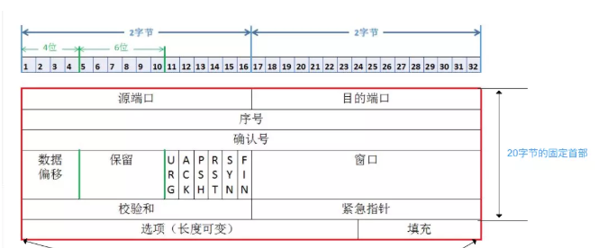
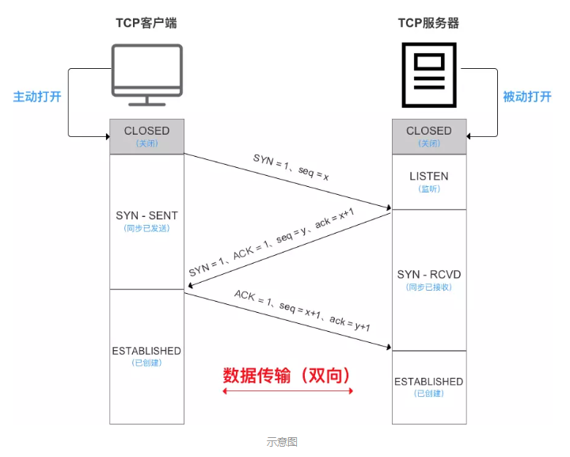
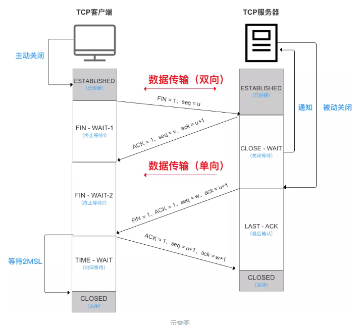
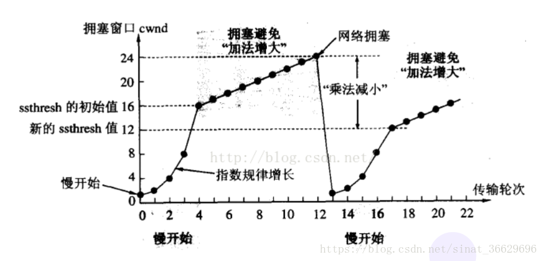
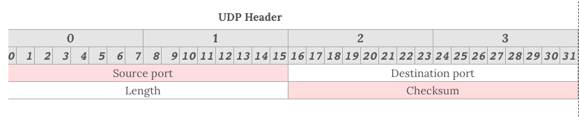

- [TCP](#tcp)
    - [TCP报文](#tcp报文)
      - [TCP首部](#tcp首部)
    - [三次握手](#三次握手)
    - [三次握手的必要性](#三次握手的必要性)
    - [四次挥手](#四次挥手)
    - [四次挥手的必要性](#四次挥手的必要性)
    - [TIME-WAIT状态等待 2MSL 进入 CLOSED 状态？](#time-wait状态等待-2msl-进入-closed-状态)
    - [为什么建立连接是三次握手，关闭连接确是四次挥手呢？](#为什么建立连接是三次握手关闭连接确是四次挥手呢)
- [TCP的无差错传输](#tcp的无差错传输)
  - [基础：滑动窗口](#基础滑动窗口)
  - [【出错重传】ARQ （超时重传）协议](#出错重传arq-超时重传协议)
    - [停止等待 ARQ](#停止等待-arq)
    - [连续 ARQ（后退n帧协议）](#连续-arq后退n帧协议)
    - [选择重传ARQ（后退n帧协议）](#选择重传arq后退n帧协议)
  - [【速度匹配】拥塞处理](#速度匹配拥塞处理)
    - [慢开始算法【指数增长】](#慢开始算法指数增长)
    - [拥塞避免算法【线性增长】](#拥塞避免算法线性增长)
    - [快速重传 && 快恢复](#快速重传--快恢复)
    - [RTT与RTO](#rtt与rto)
  - [TCP 小结](#tcp-小结)
    - [为什么TCP这么复杂?](#为什么tcp这么复杂)
    - [基于 TCP 的应用层协议](#基于-tcp-的应用层协议)
    - [WebSocket、HTTP与TCP的关系](#websockethttp与tcp的关系)
- [UDP](#udp)
    - [不可靠性](#不可靠性)
    - [高效性](#高效性)
    - [UDP报文](#udp报文)
    - [传输方式](#传输方式)
- [TCP与UDP的区别](#tcp与udp的区别)
  - [同一个IP同一个端口，可以同时建立tcp和udp链接吗](#同一个ip同一个端口可以同时建立tcp和udp链接吗)
# TCP
- TCP（Transmission Control Protocol），又叫传输控制协议。
- TCP协议是面向连接的，可靠的，基于字节流的传输协议。
- 在基于 TCP 进行通信时，通信双方需要先建立一个 TCP 连接，建立连接需要经过三次握手，断开连接的时候需要经过四次挥手。
- 基于TCP的应用层协议有HTTP、SMTP、FTP和 POP3

### TCP报文
- TCP虽面向字节流，但传送的数据单元 = 报文段
- 报文段 = 首部 + 数据 2部分
- TCP的全部功能体现在它首部中各字段的作用
#### TCP首部

 - 首部前20个字符固定、后面有4n个字节是根据需而增加的选项
 - `序列号` （Sequence number），这个序号保证了 TCP 传输的报文都是有序的，对端可以通过序号顺序的拼接报文

 - `确认号` （ACK），这个序号表示数据接收端期望接收的下一个字节的编号是多少，同时也表示上一个序号的数据已经收到

 - `窗口大小` （Window Size），表示还能接收多少字节的数据，用于流量控制

 - `标识符`
   - ACK=1 ：该字段为一表示确认号字段有效。此外，TCP 还规定在连接建立后传送的所有报文段都必须把 ACK 置为一。
   - SYN=1：当SYN=1，ACK=0时，表示当前报文段是一个连接请求报文。
   - 当SYN=1，ACK=1时，表示当前报文段是一个同意建立连接的应答报文。
   - FIN=1：该字段为一表示此报文段是一个释放连接的请求报文。
   - URG=1 :  该字段为一表示本数据报的数据部分包含紧急信息，是一个高优先级数据报文，此时紧急指针有效。紧急数据一定位于当前数据包数据部分的最前面，紧急指针标明了紧急数据的尾部。
   - PSH=1 ：该字段为一表示接收端应该立即将数据 push 给应用层，而不是等到缓冲区满后再提交。
   - RST=1：该字段为一表示当前 TCP 连接出现严重问题，可能需要重新建立 TCP 连接，也可以用于拒绝非法的报文段和拒绝连接请求。

### 三次握手

简单的说：
 - 第一次握手 c2s
   - 同步标志位SYN = 1，
   - 随机起始序号seq(client) = x
   - 不携带数据
   - 请求发送后，客户端便进入 SYN-SENT 状态。（等待服务器确认）

 - 第二次握手 s2c
   - 同步标志位SYN = 1
   - 确认标记位ACK = 1
   - 确认序号ack = x+1
   - 服务端随机起始序号seq(server) = y
   - 不携带数据
   - 发送完成后便进入 SYN-RECEIVED 已接收状态

 - 第三次握手 c2s
   - 确认标记位ACK = 1
   - 确认号字段 = y+1,
   - seq(client) = x + 1
   - 可携带数据
   - 客户端收到连接同意的应答后，还要向服务端发送一个确认报文。客户端发完这个报文段后便进入ESTABLISHED 状态，服务端收到这个应答后也进入 ESTABLISHED ，双方进入已创建状态，此时连接建立成功。
- 因 TCP提供的是全双工通信，故通信双方的应用进程在任何时候都能发送数据
- 三次握手期间，任何1次未收到对面的回复，则都会重发
- 服务端的TCP资源分配时刻 = 完成第二次握手时
- 客户端的TCP资源分配时刻 = 完成第三次握手时

### 三次握手的必要性
主要是为了防止已经失效的连接请求报文突然又传送到了服务器，从而产生错误。

假设有这样一种场景
- 客户端发送的第一个请求连接并且没有丢失，但是被滞留的时间太长。
- 由于TCP的客户端迟迟没有收到确认报文，以为服务器没有收到，此时重新向服务器发送报文。 
- 现在第一个请求到达服务端，这个请求已经报废了，服务器不知道，所以又会建立连接，等待客户端发送数据，但是客户端不会发了，死锁状态

三次握手后
- 就算是那一次失效的报文传送过来了，服务端接受到了那条失效报文并且回复了确认报文，
- 但是客户端不会再次发出确认。由于服务器收不到确认，就知道客户端并没有请求连接。不会等待，不会死锁

### 四次挥手

TCP 是全双工的，在断开连接时两端都需要发送 FIN 和 ACK。

 - 第一次挥手 c2s
   - 终止控制位 FIN=1
   - 报文段序号 seq=u，之前数据最后一个字节的序号+1
   - 可携带数据
   - 客户端进入终止等待-1状态 FIN-WAIT-1
   - 若客户端 A 认为数据发送完成，则它需要向服务端 B 发送连接释放请求。

 - 第二次挥手 s2c
   - 确认标记位ACK=1
   - 报文段序号 seq=v，之前数据最后一个字节序号+1
   - 确认号字段 ack=u+1
   - 服务器进入等待关闭状态 CLOSE-WAIT
   - 客户端收到后，进入终止等待状态-2，FIN-WAIT-2
   - 至此客户端 --> 服务端的tcp连接断开，tcp半闭状态

 - 第三次挥手 s2c
   - 如果此时还有没发完的数据会继续发送，完毕后：
   - 终止控制位 FIN=2
   - 确认标记位 ACK=1
   - 报文段序号 seq=w
   - 重复上次确认号字段 ack=u+1
   - 可携带数据
   - 服务器进入最后确认状态 LAST-ACK
   - PS：通过延迟确认的技术（通常有时间限制，否则对方会误认为需要重传），可以将第二次和第三次握手合并，延迟 ACK 包的发送。
  
 - 第四次挥手 c2s
   - 确认标记位 ACK=1
   - 报文段序号 seq=u+1
   - 确认号字段 ack=w+1
   - 可携带数据？
   - 客户端进入时间等待状态TIME-WAIT，2MSL后，无新客户端内容，则进入CLOSED状态
   - 服务端进入CLOSED状态（略先）
   - 2MSL（最大段生存期，指报文段在网络中生存的时间，超时会被抛弃

### 四次挥手的必要性
- TCP是全双工的，释放意味着双方都无法发送和接受
- 1、2后，B依然可以发数据给A，单向断开
- 3、4后，才双向断开

### TIME-WAIT状态等待 2MSL 进入 CLOSED 状态？
- MSL = 最长报文段寿命（Maximum Segment Lifetime）
- 【原因一】为了保证 B 能收到 A 的确认应答。
- 若 A 发完确认应答后直接进入 CLOSED 状态，如果确认应答因为网络问题一直没有到达，那么会造成 B 不能正常关闭。
- 等待期间若收到B重新发送的连接释放报文，A重新发送，重新进入2MSL等待，保证服务器B正常进入CLOSED
- 【原因二】客户端发送了最后1个连接释放请求确认报文后，再经过2MSL时间，则可使本连接持续时间内所产生的所有报文段都从网络中消失。在下1个新的连接中就不会出现早已失效的连接请求报文

### 为什么建立连接是三次握手，关闭连接确是四次挥手呢？
建立连接的时候， 服务器在LISTEN状态下，收到建立连接请求的SYN报文后，把ACK和SYN放在一个报文里发送给客户端。 

而关闭连接时，服务器收到对方的FIN报文时，仅仅表示对方不再发送数据了但是还能接收数据，而自己也未必全部数据都发送给对方了

# TCP的无差错传输

## 基础：滑动窗口

在 TCP 中，两端都维护着窗口：分别为发送端窗口和接收端窗口。

【发送端窗口】包含`已发送但未收到应答的数据`和`可以发送但是未发送的数据`。

- 发送端窗口是由接收窗口剩余大小决定的。接收方会把当前接收窗口的剩余大小写入应答报文，发送端收到应答后根据该值和当前网络拥塞情况设置发送窗口的大小，所以`发送窗口的大小是不断变化的`。

- 当发送端接收到应答报文后，会随之将窗口进行滑动
- 停止-等待协议、后退N帧协议 & 选择重传协议只是在发送窗口大小和接收窗口大小上有所差别：
  - 停止等待协议：发送窗口大小=1，接收窗口大小=1；即 单帧滑动窗口 等于 停止-等待协议
  - 后退N帧协议：发送窗口大小>1，接收窗口大小=1。
  - 选择重传协议：发送窗口大小>1，接收窗口大小>1。

- **滑动窗口实现了流量控制**。接收方通过报文告知发送方还可以发送多少数据，从而保证接收方能够来得及接收数据。

- **Zero 窗口**

在发送报文的过程中，可能会遇到对端出现零窗口的情况。在该情况下，发送端会停止发送数据，并启动 persistent timer 。该定时器会定时发送请求给对端，让对端告知窗口大小。在重试次数超过一定次数后，可能会中断 TCP 链接。

## 【出错重传】ARQ （超时重传）协议
传输出现差错时，接收方自动请求“发送方重传出错的数据”
通过`确认机制`和`超时重传机制`保证了数据的正确送达，ARQ 协议包含停止等待 ARQ 和连续 ARQ

### 停止等待 ARQ
【原理】
  - 停止-等待协议 + 超时重传
  - 发送窗口大小=1、接收窗口大小=1
  - 【停止-等待协议】
    - 发送方每发送一帧，要等到接收方的应答信号后才能发送下一帧
    - 接收方每接收一帧，都要反馈一个应答信号，表示可接下一帧
    - 若接收方不反馈应答信号，则发送方必须一直等待

### 连续 ARQ（后退n帧协议）
【原理】
- 多帧滑动窗口 + 累计确认 + 后退N帧 + 超时重传
- 发送窗口大小>1、接收窗口大小=1
  
【实现】
- 发送方：采用多帧滑动窗口的原理，可连续发送多个数据帧 而不需等待对方确认
- 接收方：采用 累计确认 & 后退N帧的原理，只允许按顺序接收帧。
- 【累计确认】收到多个有序帧，对最后一个发送确认即可
- 【后退N帧】最后有序帧之后的，都抛弃，需发送方重新发送

### 选择重传ARQ（后退n帧协议）
- 发送窗口大小>1、接收窗口大小>1
- 类似于类型2（后退N帧协议），此处仅仅是接收窗口大小的区别，故此处不作过多描述
- 若信道传输质量很差，导致误码率较大时，后退N帧协议不一定优于停止-等待协议

## 【速度匹配】拥塞处理

【流量控制】作用于接收方，根据自己接受缓存的大小，动态调整发送方的发送窗口大小，保证接收方来得及接受数据。

【拥塞控制】作用于网络，防止过多的数据拥塞网络，避免出现网络负载过大的情况。

【拥塞窗口】发送方根据估算网络拥塞程度，而设置的窗口值。无拥塞增大拥塞窗口；拥塞则减小拥塞窗口；使发送窗口==拥塞窗口

【拥塞处理】包括了四个算法，分别为：慢开始，拥塞避免，快速重传，快速恢复。

### 慢开始算法【指数增长】

开始时将发送窗口=1，而后每次指数级扩大，避免一开始就传输大量数据导致网络拥塞。

慢开始算法步骤具体如下
1. 连接初始设置拥塞窗口（Congestion Window） 为 1 MSS（一个分段的最大数据量）
2. 每过一个 RTT (往返时延) 就将窗口大小乘二
3. 指数级增长肯定不能没有限制的，所以有一个阈值限制，当窗口大小大于阈值时就会启动拥塞避免算法

### 拥塞避免算法【线性增长】

拥塞避免算法相比简单点，每过一个 RTT 窗口大小只加一，这样能够避免指数级增长导致网络拥塞，慢慢将大小调整到最佳值。

在传输过程中可能定时器超时的情况，这时候 TCP 会认为网络拥塞了，会马上进行以下步骤：

 - 将阈值设为当前拥塞窗口的一半
 - 将拥塞窗口设为 1 MSS
 - 启动拥塞避免算法

### 快速重传 && 快恢复
【场景】
- 快速重传一般和快恢复一起出现。
- 一旦接收端收到的报文出现失序的情况，接收端只会回复最后一个顺序正确的报文序号（没有 Sack 的情况下）。
- 如果收到三个重复的 ACK（最后一个顺序正确的），无需等待定时器超时再重发而是启动快速重传。
  
【解决】
- 方法1：快速重传
- 方法2：快速恢复：把慢开始门限设置为拥塞窗口的一半；拥塞窗口变一半；线性增大；（不从1开始）

### RTT与RTO

 - **RTT**(Round Trip Time)
   - 一个连接的往返时间，即数据发送时刻到接收到确认的时刻的差值。 
 - **RTO**(Retransmission Time Out)
   - 重传超时时间，即从数据发送时刻算起，超过这个时间便执行重传。 
 - RTT和RTO 的关系是
   - 由于网络波动的不确定性，每个RTT都是动态变化的，所以RTO也应随着RTT动态变化。

[博客链接](https://blog.csdn.net/whgtheone/article/details/80970292)

## TCP 小结

### 为什么TCP这么复杂?

因为既要保证可靠性, 同时又要尽可能提高性能

保证可靠性的机制
 - 校验和
 - 序列号(按序到达)
 - 确认应答
 - 超时重传
 - 连接管理
 - 流量控制
 - 拥塞控制

提高性能的机制
 - 滑动窗口
 - 快速重传
 - 延迟应答
 - 捎带应答

定时器
 - 超时重传定时器
 - 保活定时器
 - TIME_WAIT定时器

### 基于 TCP 的应用层协议
 - HTTP
 - HTTPS
 - SSH
 - Telnet
 - FTP
 - SMTP
### WebSocket、HTTP与TCP的关系
HTTP、WebSocket 等应用层协议，都是基于 TCP 协议来传输数据的。
既然大家都使用 TCP 协议，那么大家的连接和断开，都要遵循 TCP 协议中的三次握手和四次握手 ，只是在连接之后发送的内容不同，或者是断开的时间不同。
对于 WebSocket 来说，它必须依赖 HTTP 协议进行一次握手 ，握手成功后，数据就直接从 TCP 通道传输，与 HTTP 无关了

# UDP

UDP（User Datagram Protocol），又叫用户数据报协议。
UDP是一个无连接的、不可靠、基于数据报的传输协议。UDP只是报文（报文可以理解为一段段的数据）的搬运工，不会对报文进行任何拆分和拼装操作。

具体来说
 - 在发送端，应用层将数据传递给传输层，UDP只会给数据怎加一个UDP头标识一下这是UDP，然后就传递给网络层了，不进行任何拆分。
 - 在接收端，网络层将数据传递给传输层，UDP只取出IP报文头就传递给应用层，不进行任何拼装。

特点：
 - 面向报文
 - 不可靠传输
 - 高效

应用场景：
当强调输出性能而非完整性时，如音频和多媒体的实时传输。有个视频流传输协议RTP的实时传输就是基于UDP封装而来的。

### 不可靠性
1. UDP是**无连接**的，也就是说同学不需要建立和断开链接。
2. UDP是不可靠的。它不会去备份数据，也不关心对方是否能收到数据。
3. UDP**没有拥塞控制**，一直以恒定的速度发送数据，即使网络条件不好，也不进行速率调整。 造成的弊端就是在网络条件不好时可能导致丢包。
4. 类比于在邮局寄信

### 高效性
因为 UDP 没有 TCP 那么复杂，不需要保证数据不丢失且有序到达。所以 UDP 的头部开销小，只有八字节，相比 TCP 的至少二十字节要少得多，在传输数据报文时是很高效的。

### UDP报文
- UDP的报文段共有2个字段：数据字段 & 首部字段
- UDP包头部包含了以下几个数据

   - 伪首部
   - 源端口（可选字段，若需回信）和目标端口
   - 报文长度
   - 检验和（IPv4 可选 字段），该字段用于发现头部信息和数据中的错误

### 传输方式
支持一对一，一对多，多对多，多对一的方式，也就是说 UDP 提供了单播，多播，广播的功能。

# TCP与UDP的区别
1. TCP是面向连接的协议，需要三次握手建立连接；UDP是无连接协议，发数据前不需要建立连接
2. TCP可靠，丢包重传；UDP不可靠
3. TCP有序，传输可能乱序，但重排序；UDP无序
4. TCP无界，通过字节流传输；UDP有界，每个包独立
5. TCP有流量控制，UDP无
6. TCP传输慢（需要连接、可靠、有序），UDP快（视频广播）
7. TCP是重量级的，UDP是轻量级的
8. TCP头部大，20字节 / 8字节

## 同一个IP同一个端口，可以同时建立tcp和udp链接吗
- 可以
- udp和tcp的端口数字虽然相同，但实质上他们是不同的端口，故不影响
- 每个连接维护一个五元组：源ip、目的ip、源端口、目的端口、协议，所以即使前四个都一样，协议不一样，也就不一样了
- 在（网络层）ip层就会分流