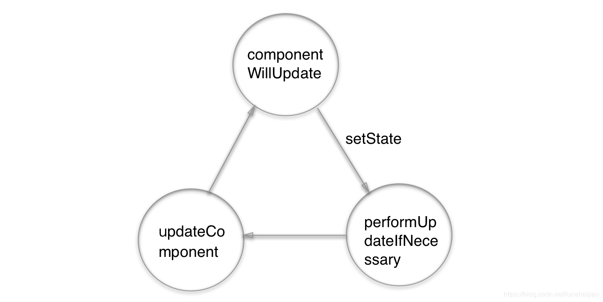

- [基础](#基础)
    - [当你调用setState的时候，发生了什么事？](#当你调用setstate的时候发生了什么事)
    - [setState第二个参数的作用](#setstate第二个参数的作用)
    - [为什么建议传递给 setState 的参数是一个 callback 而不是一个对象](#为什么建议传递给-setstate-的参数是一个-callback-而不是一个对象)
- [深入 setState 机制](#深入-setstate-机制)
    - [异步更新](#异步更新)
    - [何时同步？何时异步？](#何时同步何时异步)
    - [setState 循环调用风险](#setstate-循环调用风险)
    - [总结](#总结)
# 基础
### 当你调用setState的时候，发生了什么事？

 - 将传递给 setState 的对象合并到组件的当前状态，触发所谓的调和过程（Reconciliation）
 - 然后生成新的DOM树并和旧的DOM树使用Diff算法对比
 - 根据对比差异对界面进行最小化重渲染


### setState第二个参数的作用

因为setState是一个异步的过程，所以说执行完setState之后不能立刻更改state里面的值。如果需要对state数据更改监听，setState提供第二个参数，就是用来监听state里面数据的更改，当数据更改完成，调用回调函数。


### 为什么建议传递给 setState 的参数是一个 callback 而不是一个对象

setState它是一个异步函数，他会合并多次修改，降低diff算法的比对频率。这样也会提升性能。

因为 this.props 和 this.state 的**更新是异步的**，**不能依赖它们的值**去计算下一个 state。
# [深入 setState 机制](https://github.com/sisterAn/blog/issues/26)

### 异步更新
1. 不会立即更新
2. 所有组件使用的是同一套更新机制，当所有组件didmount后，父组件didmount，然后执行更新
3. 考虑到性能问题，setState使用一个**队列机制**来更新state。
当执行setState时，会将需要更新的state**浅合并**后放入状态队列，不会立即更新state。合并更新，每个组件只会触发一次更新的生命周期
4. 而如果不使用setState，而直接修改state的值就不会放入状态队列，下一次调用setState对状态队列进行更新的时候可能会造成不可预知的错误。
5. **解决方法**为： **传递一个签名为 (state, props) => newState 的函数作为参数。** 向setState中传入函数时，这个函数不会被浅合并，一定会执行，是一个原子性更新操作。
例子：
```js
// 假设 state.count === 0
this.setState({count: state.count + 1});
this.setState({count: state.count + 1});
this.setState({count: state.count + 1});
// state.count === 1, 而不是 3
```
本质上等同于：
```js
// 假设 state.count === 0
Object.assign(state,
    {count: state.count + 1},
    {count: state.count + 1},
    {count: state.count + 1}
)
// {count: 1}
```


```js
// 正确用法
this.setState((prevState, props) => ({
    count: prevState.count + props.increment
}))
```


### 何时同步？何时异步？
- 如果是由React引发的事件处理（合并事件、生命周期），调用setState不会同步更新this.state

- 除此之外（异步函数、原生事件）的setState调用会同步执行this.state。
- 即是绕过React通过addEventListener直接添加的事件处理函数
- 还有通过setTimeout/setInterval产生的异步调用。可以用于任何场景（合成事件、钩子、原生）
- 原理：setTimeout 的时候，把它丢到列队里，并没有去执行，而是先执行的 finally 代码块，等 finally 执行完了， isBatchingUpdates 又变为了 false ，导致最后去执行队列里的 setState 时候， requestWork 走的是和原生事件一样的 expirationTime === Sync if分支，所以表现就会和原生事件一样，可以同步拿到最新的state值。
```js
class Example extends React.Component {
  constructor() {
    super();
    this.state = {
      val: 0
    };
  }
  
  componentDidMount() {
    this.setState({val: this.state.val + 1});
    console.log(this.state.val);    // 第 1 次 log

    this.setState({val: this.state.val + 1});
    console.log(this.state.val);    // 第 2 次 log

    setTimeout(() => {
      this.setState({val: this.state.val + 1});
      console.log(this.state.val);  // 第 3 次 log

      this.setState({val: this.state.val + 1});
      console.log(this.state.val);  // 第 4 次 log
    }, 0);
  }

  render() {
    return null;
  }
};

答案是 0 0 2 3
```
### setState 循环调用风险

但，如果在`shouldComponentUpdate`或`componentWillUpdate` 方法里调用 this.setState 方法，就会造成崩溃。


### 总结
1. setState 只在（react包装）合成事件和钩子函数中是“异步”的，在原生事件和 setTimeout 中都是同步的。
2. 本身执行的过程和代码都是同步的，只是合成事件和钩子函数的调用顺序在更新之前，导致在合成事件和钩子函数中没法立马拿到更新后的值，形式了所谓的“异步
3. “异步”是一种优化，批量更新；若多次赋值，覆盖