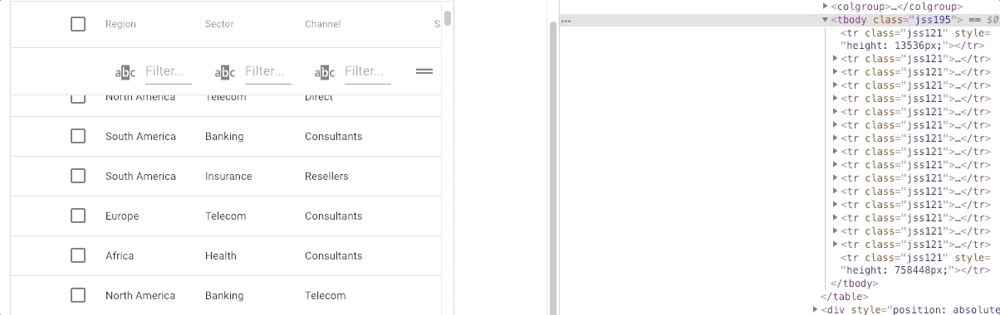

- [性能优化](#性能优化)
  - [网络优化](#网络优化)
  - [webpack中优化](#webpack中优化)
  - [编写高性能的Javascript](#编写高性能的javascript)
  - [浏览器渲染](#浏览器渲染)
    - [加快首屏渲染](#加快首屏渲染)
  - [CDN](#cdn)
- [性能优化从哪些方面入手](#性能优化从哪些方面入手)
- [插入几万个 DOM，如何实现页面不卡顿？](#插入几万个-dom如何实现页面不卡顿)

## 性能优化

 - 资源压缩合并，减少HTTP请求，开启gzip压缩
 - 非核心代码的异步加载
   - 异步加载方式
   - 异步加载的区别
 - 利用浏览器缓存
   - 缓存分类
   - 缓存原理
 - 使用CDN
 - DNS预解析

### [网络优化](网络优化.md)
压缩传输内容，用好缓存

### [webpack中优化](webpack中优化.md)
主要就是为了减少Webpack打包后的文件体积

### [编写高性能的Javascript](编写高性能的Javascript.md)

### [浏览器渲染](../0-HTML&浏览器/浏览器内核&渲染.md)
#### 加快首屏渲染
- 降低请求量：合并资源，减少 HTTP 请求数，minify / gzip（首次请求合并压缩），webP(比jpg等小很多)，lazyload。
- 加快请求速度：预解析DNS，减少域名数，并行加载，CDN 分发。
- 增加缓存：HTTP 协议缓存请求，离线缓存 manifest，离线数据缓存 localStorage、PWA。
- 渲染优化：首屏内容最小化，JS/CSS优化，加载顺序，服务端渲染，pipeline。

### [CDN](CDN.md)

## 性能优化从哪些方面入手
- 分屏加载，当页面需要渲染的数据较多时，先渲染首屏，下滑时再加载第二屏的数据；
- 图片大小优化，在不影响视觉效果的前提下，把图片尺寸降到最小；
- 图片懒加载，on appear时再加载图片；①将img标签的src指向同一张图（如空白），然后给img标签设置自定义属性（比如 data-src）②当JS监听到该图片元素进入可视窗口时，src属性修改。达到懒加载的效果。
- Code splitting，或者拆包，应用下的某些组件不需要立刻import，可以采用动态import的方式，打包时也可以将它们打到不同的bundle里，给index bundle瘦身；
- Chrome Devtools - Trace & Timeline等一系列强大的分析工具可以去研究一下，它们可以深入到内核分析应用的性能问题所在；

## 插入几万个 DOM，如何实现页面不卡顿？

肯定不能一次性把几万个 DOM 全部插入，这样肯定会造成卡顿，所以解决问题的重点应该是如何分批次部分渲染 DOM。部分人应该可以想到通过 `requestAnimationFrame` 的方式去循环的插入 DOM，其实还有种方式去解决这个问题：**虚拟滚动**（virtualized scroller）。

这种技术的原理就是只渲染可视区域内的内容，非可见区域的那就完全不渲染了，当用户在滚动的时候就实时去替换渲染的内容。

从上图中我们可以发现，即使列表很长，但是渲染的 DOM 元素永远只有那么几个，当我们滚动页面的时候就会实时去更新 DOM，这个技术就能顺利解决这发问题。如果你想了解更多的内容可以了解下这个 [react-virtualized](https://github.com/bvaughn/react-virtualized)。
